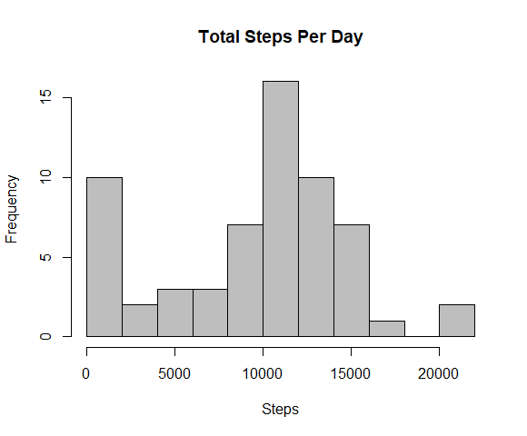

---
title: "Reproducible Research _Grade_Assesment 1"
author: "Shashikesh Mishra"
date: "19 June 2017"
output: html_document??
keep_md: true

---??
## This Document contian complete work of Reproducible Research Asssessment 1;

##Loading and Preparing data;

```{r, echo=TRUE}
getwd()
mydata<- read.csv("C:/Users/sk_mi/Desktop/Coursera/Reproducible Research/week 2/repdata%2Fdata%2Factivity/activity.csv")
str(mydata)
```
```
'data.frame':	17568 obs. of  3 variables:
 $ steps   : int  NA NA NA NA NA NA NA NA NA NA ...
 $ date    : Factor w/ 61 levels "2012-10-01","2012-10-02",..: 1 1 1 1 1 1 1 1 1 1 ...
 $ interval: int  0 5 10 15 20 25 30 35 40 45 ...
 ```

```{r, echo=TRUE}
head(mydata)
```
```
steps       date interval
1    NA 2012-10-01        0
2    NA 2012-10-01        5
3    NA 2012-10-01       10
4    NA 2012-10-01       15
5    NA 2012-10-01       20
6    NA 2012-10-01       25
```

```{r, echo=TRUE}
tail(mydata)
```
```
      steps       date interval
17563    NA 2012-11-30     2330
17564    NA 2012-11-30     2335
17565    NA 2012-11-30     2340
17566    NA 2012-11-30     2345
17567    NA 2012-11-30     2350
17568    NA 2012-11-30     2355
```


## What is mean total number of steps taken per day?;

```{r}
steps_perday<- aggregate(steps~date, mydata, sum)
hist(steps_perday$steps, main = "Steps Taken Per day", xlab = "Steps", col = "blue", breaks = 8)
```

## Let's find the mean and median of the total no of steps;

```{r, echo=TRUE}
meansteps_perday<- mean(steps_perday$steps)
mediansteps_perday<- median(steps_perday$steps)
print(meansteps_perday)
print(mediansteps_perday)
```
```
> print(meansteps_perday)
[1] 10766.19
> print(mediansteps_perday)
[1] 10765
```

### Note: As we can see mean and median are both pretty much close to each other, this is how we can sense the average value of mydata.

## What is the average daily activity pattern?;
### by anwering this question, we will accomplished two below statement;
* We will make a time series plot of the 5-minute interval (x-axis) and the average number of steps taken, averaged across all days (y-axis)
*Which 5-minute interval, on average across all the days in the dataset, contains the maximum number of steps?

```{r, echo=TRUE}
steps_interval<- aggregate(steps ~ interval, mydata, mean)
plot(steps_interval$interval, steps_interval$steps, type="l", xlab = "5 min - interval", ylab = "Average steps", main = "Average Daily Activity Pattern", col = "blue")
steps_interval$interval[which.max(steps_interval$steps)]
```
```
> steps_interval$interval[which.max(steps_interval$steps)]
[1] 835
```

##  Imputing missing values;
Note that there are a number of days/intervals where there are missing values (coded as NA). The presence of missing days may introduce bias into some calculations or summaries of the data.

### We will calculate the total number of missing values in the dataset;
```{r, echo=TRUE}
nrow(mydata[is.na(mydata$steps),])
```
```
> nrow(mydata[is.na(mydata$steps),])
[1] 2304
```

### Now we will devise a "strategy" for filling in all of the missing values in the dataset;
```{r, echo=TRUE}
newdata_withoutNAs<- mydata
newdata_withoutNAs[is.na(newdata_withoutNAs$steps), "steps"]<- 0 ## Putting na = 0
```

As we have already replaced NA with numeric data 0;

### Now will create histogram of the total number of steps taken each day;

```{r, echo=TRUE}
steps_perday_withoutNAs<- aggregate(steps ~ date, newdata_withoutNAs, sum)

hist(steps_perday_withoutNAs$steps, main = "Total Steps Per Day", xlab = "Steps", col = "grey", breaks = 10)
```

### and Calculate and report the mean and median total number of steps taken per day;

```{r, echo=TRUE}
meansteps_perday_withoutNAs<- mean(steps_perday_withoutNAs$steps)
mediansteps_perday_withoutNAs<- median(steps_perday_withoutNAs$steps)
print(meansteps_perday_withoutNAs)  # mean
print(mediansteps_perday_withoutNAs)  # median
```
```
> print(meansteps_perday_withoutNAs)  # mean
[1] 9354.23
> print(mediansteps_perday_withoutNAs)  # median
[1] 10395
```

The mean and the median are now almost the same after replacing missing values with the mean value for the relevant interval. It makes sense that the median value would now move closer to the mean. So the Median value increased after this method of missing value replacement.

##  Are there differences in activity patterns between weekdays and weekends?;
Now we are going to create a new factor variable in the dataset with two levels - "weekday" and "weekend" indicating whether a given date is a weekday or weekend day.

```{r, echo=TRUE}
newdata_withoutNAs$day=ifelse(as.POSIXlt(as.Date(newdata_withoutNAs$date))$wday%%6==0,"weekend","weekday")
newdata_withoutNAs$daytype=factor(newdata_withoutNAs$day,levels=c("weekday","weekend"))
```

### finally now will create a panel plot containing a time series plot (i.e. type = "l") of the 5-minute interval (x-axis) and the average number of steps taken, averaged across all weekday days or weekend days (y-axis).;

```{r, echo=TRUE}
stepsInterval2=aggregate(steps~interval+day,newdata_withoutNAs,mean)
library(lattice)
xyplot(steps~interval|factor(day),data=stepsInterval2,aspect=1/2,type="l")
```


